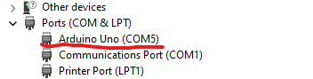
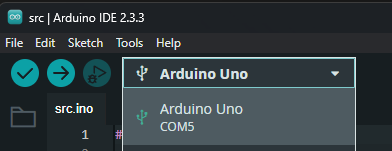

# eweek_arduino

## Dependencies
- [Arduino IDE 2.3.3](https://www.arduino.cc/en/software)

## Resources
- [QTR-8RC Reflectance Sensor Array](https://www.pololu.com/product/961)
- [Arduino UNO R3 Documentation](https://docs.arduino.cc/hardware/uno-rev3/)

## Device Startup
1. Plug the arduino into your laptop and ensure the power LED comes on
1. Open Windows Device Manager, look to see what COM port the arduino uno appears on

    

1. In arduino IDE, select the board option of Arduino Uno then select the correct COM port

    

1. If you hit the upload (arrow button) on a basic file with an empty setup{} and loop{} you should see the 2 LED's labeled TX and RX flash rapidly indicating that a connection is made to the host and data is being transferred

## Examples
1. In the Arduino IDE, examples can be found under File->Examples
1. Open a basic blink example in File->Examples->0.1Basics->Blink
1. Once it's open and you're connected to the Arduino Uno then hit the upload (arrow) button to run and the designated LED near digital pin 13 should blink, while the TX and RX pins also blink rapidly to show that data is being transferred from host
